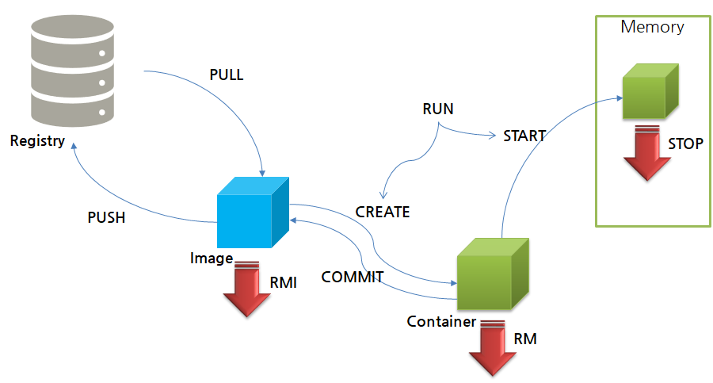

# Docker

* Lifecycle of Docker
	* PULL : 레지스트리에서 이미지를 가져온다.
	* PUSH : 레지스트리에 이미지를 등록한다.
	* CREATE : 컨테이너를 생성한다.
	* START : 컨테이너를 실행한다. (메모리에 올라감)
	* RUN(CREATE + START) : 컨테이너를 생성함과 동시에 실행한다.
	*  COMMIT : 이미지에 변경분을 커밋한다.
	* RM : 컨테이너를 삭제한다.
	* RMI : 이미지를 삭제한다.
	* STOP : 컨테이너를 중단시킨다. 
        



---

* 이미지를 통해서 실제로 컨테이너의 데이터는 어디에 저장되는가?

  * 먼저 도커 이미지의 저장소 위치를 확인해보자.


  ```bash
  sudo docker info
  sudo cd /var/lib/docker/overlay2
  ```

  * 해당 디렉토리에는 아래와 같은 목록이 존재한다

  ```bash
  kaeum@docker-test:/var/lib/docker/overlay2# ls
  0cc29ea5605872d9c8291673064e85b07160203fbf04b34eeeed899731361960 # 레이어 변경 사항 저장
  615767e7221dbc99b8e441e35a88df5d74c911f2674ceaa28001388535e95be2 # 레이어 변경 사항 저장
  9f3bb671f38d7f61f661af369d420cdedb195e4d623bdb6ba8e3b045f72e8d69 # 레이어 변경 사항 저장
  l # 원본 레이어 저장
  ```

  * 컨테이너의 루트 디렉터리의 용량을 확인해보면 아래와 같다. 거의 대부분이 overlay2에 위치하는 것을 알 수 있다.

  ```bash
  du -sh /var/lib/docker/ #도커가 설치된 환경 용량 확인
  2.0G	/var/lib/docker/
  du -sh /var/lib/docker/image/ # 도커 이미지에 대한 정보 저장 디렉토리
  2.7M	/var/lib/docker/image/
  du -sh /var/lib/docker/overlay2/ # 도커 이미지의 파일 시스템이 사용되는 실제 디렉토리
  2.0G	/var/lib/docker/overlay2/
  du -sh /var/lib/docker/containers/ # 도커 컨테이너 정보 저장 디렉토리
  136K	/var/lib/docker/containers/

---

* 알아둘만한 도커 명령어들!
	* 포트 포워딩 : 호스트의 80번 포트를 톰캣의 8080 포트로.

	```bash
	sudo docker run -d --name tc -p 80:8080 tomcat
	```
	* 내부 셸(bash) 실행 

	```bash
	sudo docker exec -it tc /bin/bash
	```
	* 컨테이너 로그 확인

	```bash
	sudo docker logs tc
	```
	* 컨테이너 전부 삭제하기

	```bash
	sudo docker stop `sudo docker ps -a -q` # 모든 컨테이너 중단
	sudo docker rm `sudo docker ps -a -q` # 모든 컨테이너 삭제
	sudo docker rmi `sudo docker images -a -q` # 모든 이미지 삭제
	```
	
	* 컨테이너 임시로 생성(중단 시 자동으로 삭제)

	```bash
	sudo docker run -d -p 80:8080 --rm --name tc tomcat
	```
	
	* run 명령어 사용 시 환경 변수 전달하기

	```bash
	sudo docker run --name msql -e MYSQL_ROOT_PASSWORD='!qlalfqjsgh123' -d mysql
	sudo docker exec -it msql mysql
	password: !qlalfqjsgh123
	mysql>
	```
	
	* 볼륨 마운트하기(호스트의 파일 공유하기) : *docker run -v <호스트 경로>:<컨테이너 경로>:권한*

	```bash
	sudo docker run -d -p 80:80 -v /var/www:/usr/share/nginx/html:ro nginx # ro(읽기), rw(읽기쓰기)
	```